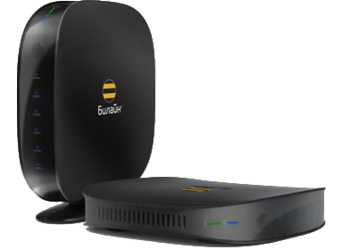

# N300 VPN — VPN на Beeline SmartBox N300 (beta 0.1)



Я сделал этот проект для старого **Beeline SmartBox N300**. Он запускает лёгкий VLESS-клиент на роутере, а все рабочие файлы хранит на USB-флешке. Внутренняя flash-память не меняются (ну в моем случае)

Целевая платформа: **Realtek RTL8197D/Lexra, 660 МГц, 64 МБ RAM, OpenWrt Barrier Breaker 14.07**. На других моделях бинарник не гарантируется.

## Что умеет проект

- VLESS TCP, Reality/Vision, TLS, WebSocket и gRPC;
- веб-панель `http://192.168.2.1:8080/cgi-bin/n300vpn`;
- серверы из [vpn-configs-for-russia](https://github.com/igareck/vpn-configs-for-russia);
- добавление собственной подписки из Happ/V2RayTun;
- проверка сети, YouTube и выбор лучшего сервера;
- максимум четыре одновременных соединения для слабого процессора;
- откат маршрутов при неудачной проверке;
- VPN выключен после установки.

## Что подготовить (если вы как я через флешку)

Нужен роутер(в моем случае Beeline Smart Box n300) с OpenWrt, USB-флешка ext4, Ethernet-кабель, компьютер и ваш root-пароль SSH. На время установки подключите только ОДИН LAN-кабель И В LAN1 КАБЕЛЬ и выключите VPN на компьютере. (если включен)

## Установка

1. Подключите флешку. Она должна быть `/mnt/usb`.
2. Распакуйте архив так, чтобы существовал путь `/mnt/usb/n300vpn/bin/n300vless`.
3. Подключитесь к роутеру (старому SSH нужны эти алгоритмы):

```text
ssh -oKexAlgorithms=+diffie-hellman-group14-sha1,diffie-hellman-group1-sha1 -oHostKeyAlgorithms=+ssh-rsa -oMACs=+hmac-sha1 root@192.168.2.1
```

Введите свой пароль 

4. Запустите установщик:

```sh
chmod 700 /mnt/usb/n300vpn/install.sh
/mnt/usb/n300vpn/install.sh
```

Установщик создаёт каталоги, выставляет права и ничего не перезагружает.

5. Откройте в браузере `http://192.168.2.1:8080/cgi-bin/n300vpn`.


Если видите `ERR_CONNECTION_REFUSED`, выполните по SSH:

```sh
/mnt/usb/n300vpn/bin/n300vpn-web.sh start
```

## Первый запуск

Нажмите «Обновить списки», дождитесь окончания, затем проверьте сервер кнопкой «Проверить сеть». Для автоматического выбора нажмите «Выбрать лучший для YouTube». Только после успешного теста нажимайте «Подключить» у одного сервера.


### Пинг БОЛЬШОЙ та как с бесплатного репозитория берется что я писал выше! вы можете добавить свой ключ и роутер его увидит. (не все я делал тесты только по одному Crunch другие вроде как не думаю что заработают)

## Своя подписка

Нажмите «Добавить подписку», вставьте ссылку из Happ или V2RayTun и сохраните. Она хранится только на USB в `/mnt/usb/n300vpn/private/subscription.url` с правами `0600`. 

## Выключение и восстановление

В панели нажмите «Выключить VPN». Если панель не открывается, подключитесь по LAN и выполните:

```sh
/mnt/usb/n300vpn/bin/n300vpn-control.sh disable
/mnt/usb/n300vpn/bin/n300vpn-control.sh status
```

При зависшем процессе:

```sh
killall n300vless 2>/dev/null || true
/mnt/usb/n300vpn/bin/n300vpn-control.sh disable
```

Если вынуть USB после отключения VPN, внутренняя прошивка останется нетронутой.

## Wi‑Fi и безопасность

Слабый Wi‑Fi на старом OpenWrt — отдельное ограничение штатного драйвера. Я ВООБЩЕ НЕ рекомендую менять мощность, ядро или драйвер случайными пакетами. Установку и первые тесты проводите через LAN. Не выдёргивайте флешку во время обновления списков и не запускайте несколько проверок одновременно. это дело во всем OpenWrt старом. возможно мне прост не повезло с версией его

## Обновление и сборка

Обновляйте списки кнопкой в панели: старый рабочий список сохраняется при ошибке источника. Исходник `src/n300vless.c` и `Makefile` включены для сборки Lexra/RSDK; обычный x86 или MIPS-бинарник не подходит.

Аппаратные сведения сверены по [4PDA](https://4pda.to/forum/index.php?showtopic=794426&st=3560) и [DeviWiki](https://deviwiki.com/wiki/Beeline_SmartBox). Внешние компоненты сохраняют лицензии своих авторов; проект не является официальным ПО Beeline.

Обновления этого ресурса не думаю, что будут. Если хотите улучшить проект, то просто, пожалуйста, отметьте меня. Изначально проект был с «Запретом внутри», но железо оказалось настолько слабым, что просто он отключался аварийно (возможно, как-то я не очень оптимизировал проект, но, учитывая, что всё, что было в интернете для него, либо не подходящие, либо мусор-пустышка в плане того, что уже было удалено). Поэтому решил сделать VPN :)


